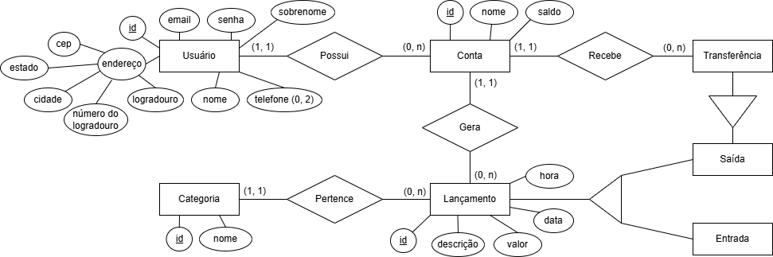

# 🚀 API para Dashboard de Finanças Pessoais

Está é uma API REST para gestão de finanças pessoais. Ela permite que o usuário tenha controle sobre as suas despesas e observe o seu saldo durante o mês. Além disso, o usuário pode adicionar várias contas bancárias e rastrear a partir delas as transações realizadas ao longo do dia, fornecendo o total de receitas, despesas e as categorias nas quais se enquadram. Desenvolverei o backend em duas fases: primeiro, criarei a API em C# e depois em Java.

# ✔ Status do Projeto

🏗️ Status: Em Desenvolvimento (Fase de Modelagem)

# 💻 Tecnologias utilizadas

<ul>
  <li><strong>Backend:</strong> Java e C#</li>
  <li><strong>Banco de Dados:</strong> MySQL</li>
  <li><strong>Modelagem:</strong> draw.io</li>
</ul>

# 📐 Modelagem de Dados

Abaixo está o diagrama conceitual do banco de dados. Criei as devidas entidades e relacionamentos, além de algumas especializações para garantir maior integridade dos dados.

